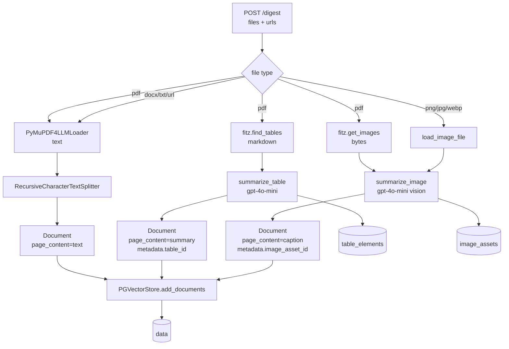
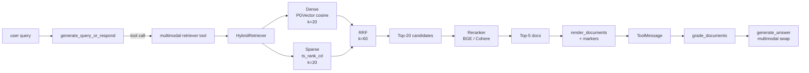

# Multi-Modal RAG Architecture

This document is the deep dive on how the multi-modal RAG pipeline works
in this project. It is the reference for anyone changing the ingestion,
retrieval, or answer-generation paths. The README has the high-level tour;
this is the implementation contract.

---

## 1. Overview — Option 3 (text + table + image summaries)

We follow **Option 3** of the LangChain semi-structured / multi-modal RAG
cookbook:

> Use a multimodal LLM (such as GPT-4o, GPT-4V, LLaVA) to produce text,
> table, and image summaries. Embed and retrieve text, table, and image
> summaries with reference to the raw elements. Raw images, tables, and
> text chunks are passed to a multimodal LLM for answer synthesis.

Concretely:

1. **Text** is chunked and embedded as-is.
2. **Tables** (from PDFs) are extracted as markdown, summarized by the
   multimodal LLM, and the summary is embedded. The raw markdown is
   stored in `table_elements` keyed by a UUID `table_id` that is mirrored
   into the chunk's PGVector metadata.
3. **Images** (PDF embedded or directly uploaded) are captioned by the
   vision LLM, the caption is embedded. The raw bytes are stored in
   `image_assets` keyed by a UUID `image_asset_id` that is mirrored into
   the chunk's PGVector metadata.

At retrieval time, the embeddings drive the search. At answer time, the
markers in the retrieved chunks are used to fetch the **raw** tables and
images and inject them back into the LLM prompt — the multi-vector swap.

Two performance layers sit on top of the retrieval:

- **Hybrid retrieval**: dense (PGVector cosine) + sparse (Postgres FTS via
  `tsvector`) fused with Reciprocal Rank Fusion (RRF, k=60).
- **Reranker**: a pluggable cross-encoder (BGE-reranker-v2-m3 by default,
  Cohere Rerank v4-fast as an optional managed alternative) refines the
  fused candidate list down to top-K.

---

## 2. Reference reading

- LangChain blog — [Semi-structured & multi-modal RAG](https://blog.langchain.com/semi-structured-multi-modal-rag/)
- LangChain cookbook — [`multi_modal_RAG_chroma.ipynb`](https://github.com/langchain-ai/langchain/blob/v0.3/cookbook/multi_modal_RAG_chroma.ipynb)
- LangChain cookbook — [`Semi_structured_and_multi_modal_RAG.ipynb`](https://github.com/langchain-ai/langchain/blob/v0.3/cookbook/Semi_structured_and_multi_modal_RAG.ipynb)
- AnalyticsVidhya — [Guide to Building Multimodal RAG Systems](https://www.analyticsvidhya.com/blog/2024/09/guide-to-building-multimodal-rag-systems/)
- Cormack et al., 2009 — [Reciprocal Rank Fusion outperforms Condorcet and individual rank learning methods](https://plg.uwaterloo.ca/~gvcormac/cormacksigir09-rrf.pdf)
- BAAI — [bge-reranker-v2-m3](https://huggingface.co/BAAI/bge-reranker-v2-m3)
- Cohere — [Rerank v4](https://docs.cohere.com/reference/rerank)

---

## 3. Data model

### 3.1 New tables

Defined in `app/models/database.py` and migrated in
`alembic/versions/7a2c1f3e9b4d_add_image_assets_and_table_elements.py`.

```python
class ImageAsset(Base):
    __tablename__ = "image_assets"
    id           = Column(String, primary_key=True)              # uuid
    user_id      = Column(Integer, ForeignKey("users.id"),     nullable=False)
    document_id  = Column(Integer, ForeignKey("documents.id"), nullable=True)
    mime_type    = Column(String, nullable=False)
    image_bytes  = Column(LargeBinary, nullable=False)
    summary      = Column(Text, nullable=False)
    page_number  = Column(Integer, nullable=True)
    created_at   = Column(DateTime(timezone=True), server_default=func.now())

class TableElement(Base):
    __tablename__ = "table_elements"
    id           = Column(String, primary_key=True)              # uuid
    user_id      = Column(Integer, ForeignKey("users.id"),     nullable=False)
    document_id  = Column(Integer, ForeignKey("documents.id"), nullable=True)
    raw_markdown = Column(Text, nullable=False)
    summary      = Column(Text, nullable=False)
    page_number  = Column(Integer, nullable=True)
    created_at   = Column(DateTime(timezone=True), server_default=func.now())
```

Both have FK `ON DELETE CASCADE` on `documents.id` and `users.id`. Removing
a Document automatically drops its raw assets.

### 3.2 PGVector chunk metadata

Every PGVector chunk carries `metadata.user_id` for tenant isolation. In
addition:

| `content_type`     | extra metadata keys     | what's in `page_content`         |
| ------------------ | ----------------------- | -------------------------------- |
| _missing_ (text)   | `source_type`, `page`, `source_path` | raw text chunk                   |
| `table_summary`    | `table_id`, `page`, `source_type`, `source_path`         | LLM summary of the table        |
| `image_summary`    | `image_asset_id`, `page`, `source_type`, `source_path`   | LLM caption of the image        |

### 3.3 Sparse index on the PGVector `data` table

Migration
`alembic/versions/8b3d2e0a4c5f_add_pgvector_fts_index.py`
adds a generated tsvector column and a GIN index, plus a btree on the
JSONB `user_id` extract:

```sql
ALTER TABLE data ADD COLUMN IF NOT EXISTS tsv tsvector
  GENERATED ALWAYS AS (to_tsvector('english', content)) STORED;

CREATE INDEX IF NOT EXISTS data_tsv_gin_idx
  ON data USING GIN (tsv);

CREATE INDEX IF NOT EXISTS data_user_id_idx
  ON data ((langchain_metadata->>'user_id'));
```

The `data` table is created lazily on first ingestion by
`langchain-postgres`, so the migration no-ops when the table doesn't exist
yet. `VectorStoreService._ensure_fts_infrastructure` re-runs the same DDL
idempotently on first vector-store init, so the indexes are guaranteed to
exist after the first ingestion regardless of when migrations were run.

---

## 4. Ingestion pipeline

### 4.1 Diagram



### 4.2 Walkthrough

`app/api/v1/endpoints/digest.py` is the entrypoint. For each uploaded
file it:

1. Creates a `Document` row first (so we have an `id` to back-reference
   raw assets to for cascade deletion).
2. Calls `IngestionService.ingest_files` with `db` + `document_id`.
3. The service dispatches by `get_file_type`:

   - **PDF**: load text with `PyMuPDF4LLMLoader`, split into chunks; then
     extract tables (`extract_tables_from_pdf`) and images
     (`extract_images_from_pdf`); summarize each, persist raw markdown /
     bytes into `table_elements` / `image_assets`; create a Document
     per summary.
   - **DOCX / TXT / MD**: text-only, existing behavior.
   - **Image upload**: caption the bytes, persist them, single chunk.

4. All chunks (text + summary) go through `vector_store_service.add_documents`,
   which stamps `user_id` into each chunk's metadata before insertion.
5. The Document row's `chunk_count` and `document_ids` are updated, then
   the transaction commits.

### 4.3 Caps

- `MAX_IMAGES_PER_DOC` (default 50) — caps embedded images extracted per
  PDF.
- `MAX_TABLES_PER_DOC` (default 30) — caps tables per PDF.

Both are enforced before summarization to keep ingestion costs bounded.

### 4.4 Failure isolation

If a single image / table fails to summarize, we log a warning and
continue. The text branch always runs first; partial failures in the
multimodal branches don't break text-only retrieval.

---

## 5. Retrieval pipeline

### 5.1 Diagram



### 5.2 Hybrid retrieval

Implemented in `app/services/hybrid_retriever.py`.

**Dense arm**: existing `PGVectorStore.similarity_search`. We over-fetch
by a `dense_fetch_multiplier` (3x) to leave headroom for the user_id
post-filter (cf. legacy `UserFilteredRetriever`).

**Sparse arm**: raw SQL via SQLAlchemy synchronous engine:

```sql
SELECT langchain_id, content, langchain_metadata,
       ts_rank_cd(tsv, plainto_tsquery('english', :q)) AS score
FROM data
WHERE tsv @@ plainto_tsquery('english', :q)
  AND langchain_metadata->>'user_id' = :uid
ORDER BY score DESC
LIMIT :k;
```

`plainto_tsquery` accepts arbitrary user input without operator escaping.
The `user_id` filter runs in SQL (cheap, indexed) rather than as a
post-filter.

### 5.3 Reciprocal Rank Fusion

```
score(d) = Σ 1 / (k_rrf + rank_i(d))
```

with `k_rrf = 60` (industry-standard) and one term per ranked list
(dense, sparse). Implemented in
`reciprocal_rank_fusion` (`hybrid_retriever.py`). Documents are deduped
by `langchain_id` when present, otherwise by content hash.

**Why RRF instead of weighted sum of normalised scores?** Cosine
similarity (∈ [0, 1]) and `ts_rank_cd` (unbounded) are on incompatible
scales. RRF only consumes ranks, so the fusion is robust without per-
arm normalization.

### 5.4 Reranker

`app/services/reranker_service.py` exposes a `Reranker` Protocol with
three implementations:

- `BGEReranker` — `BAAI/bge-reranker-v2-m3` via `sentence-transformers`.
  Default. Self-hosted, ~80 ms on CPU for 50 pairs.
- `CohereReranker` — managed Cohere Rerank v4. Selected when
  `RERANKER_PROVIDER=cohere` and `COHERE_API_KEY` is set.
- `NoopReranker` — for debugging.

`get_reranker()` is a thread-safe lazy singleton. Imports of the heavy
dependencies (`sentence-transformers`, `cohere`) are deferred until the
reranker is actually used, so app startup stays fast.

### 5.5 Wired pipeline

`VectorStoreService.get_retriever` returns a `HybridReranKRetriever`
that runs:

1. `HybridRetriever` → `HYBRID_FINAL_K` candidates (default 20).
2. Cross-encoder rerank → `RERANK_TOP_K` final docs (default 5).

Both stages run synchronously (LangGraph tool nodes are sync). All retrieval
logging goes through the existing `RetrievalLogger`.

---

## 6. Multi-vector swap at answer time

### 6.1 Marker format

The multimodal retriever tool (`app/workflows/tools/multimodal_retriever_tool.py`)
renders each document like this:

```
[doc 1] (page 4) <raw text content>

[doc 2] (page 7, table_id=3f9c-...) Table summary: monthly revenue ...

[doc 3] (page 12, image_asset_id=8d2e-...) Image summary: bar chart ...
```

The markers are intentionally simple `key=uuid` pairs the LLM is unlikely
to corrupt.

### 6.2 Swap in `generate_answer`

`app/workflows/nodes.py::generate_answer`:

1. Reads the most recent tool message content.
2. Regex-extracts up to `MAX_IMAGES_IN_ANSWER` `image_asset_id`s and
   `MAX_TABLES_IN_ANSWER` `table_id`s.
3. Fetches the raw rows from `image_assets` / `table_elements` in a
   single SQLAlchemy session.
4. **Tables**: appended verbatim to the prompt context under a "Raw
   table" section so the model sees the actual numbers, not a paraphrase.
5. **Images**: each gets base64-encoded into an `image_url` content part
   on a multimodal `HumanMessage`:

   ```python
   HumanMessage(content=[
       {"type": "text", "text": prompt},
       {"type": "image_url", "image_url": {"url": "data:image/png;base64,..."}},
       ...
   ])
   ```

6. Falls back to a text-only message if there are no images.
7. If asset lookup fails (DB unreachable, ids stale), we degrade to using
   only the summaries — the agent never crashes mid-conversation.

### 6.3 Why pass raw images instead of just summaries?

Summaries are good enough for retrieval (the summary captures _what_ the
image is about) but they lose precision (exact numbers in a chart, fine
text on a diagram). Vision LLMs at answer time get the original pixels,
which is the whole point of Option 3 vs. caption-only RAG.

---

## 7. LangGraph workflow integration

The graph (`app/workflows/rag_graph.py`) is unchanged structurally:

```
START → generate_query_or_respond → [tools] → grade_documents
                                          ↘ generate_answer → END
                                          ↘ rewrite_question → generate_query_or_respond
```

What changed:

- The retriever tool is now `create_multimodal_retriever_tool` instead of
  `create_retriever_tool`. The signature and tool message contract are
  identical from the model's perspective; the only difference is the
  marker rendering.
- The retriever passed in is `HybridReranKRetriever`, not a bare PGVector
  retriever.
- `generate_answer` is multimodal-aware (see §6).
- `prompts.json` `generate_answer.template` mentions raw tables and
  attached images.

`grade_documents` and `rewrite_question` are unchanged. The grader still
operates on the textual tool message; if a chunk is a summary, the
grader sees the summary, which is exactly what semantic relevance
assessment needs.

---

## 8. User isolation guarantees

Every layer enforces `user_id`:

1. **Ingestion**: `vector_store_service.add_documents(documents, user_id=...)`
   stamps `user_id` into PGVector metadata. Raw asset rows include a
   `user_id` FK.
2. **Dense retrieval**: post-filter by `metadata.user_id` (over-fetch
   pattern preserved from the legacy retriever).
3. **Sparse retrieval**: SQL `WHERE langchain_metadata->>'user_id' = :uid`.
4. **Asset lookup**: `image_assets` / `table_elements` queries in
   `generate_answer` are matched by id; ids are uuid v4 (collision-free)
   AND the foreign keys are scoped per-user.
5. **Removal**: `_delete_linked_assets` filters by both `id IN (...)`
   AND `user_id = current_user.id`. The by-record endpoint relies on
   `ON DELETE CASCADE` from the FK to `documents.id`, which is itself
   user-scoped.
6. **Tool layer**: `chat_service` resolves the retriever via
   `get_retriever(user_id=current_user.id)`; the user_id is set on the
   retriever instance, not derived from the query.

There is no path where one user's `image_asset_id` could be resolved
against another user's row without an explicit user_id mismatch causing
a no-op.

---

## 9. Prompt templates

All in `app/workflows/prompts.json`.

### 9.1 `image_summary`

> You are summarizing an image so it can be retrieved later by semantic
> search. Describe the image in detail, optimised for retrieval. Cover:
> subject and key entities, any visible text, numbers, labels, or
> captions, the structure of charts, diagrams, or tables, and the likely
> topic the image is about. Be specific and dense; aim for three to five
> sentences. ...

### 9.2 `table_summary`

> You are summarizing a table so it can be retrieved later by semantic
> search. The table is provided below as markdown. Give a detailed
> summary of what the table contains, optimised for retrieval. ...

### 9.3 `generate_answer` (revised)

The system instruction was extended to mention raw tables (look for
"Raw table:") and attached images. The behavior on text-only contexts is
unchanged.

---

## 10. Configuration reference

All settings in `app/core/config.py`. Defaults shown.

| Setting                  | Default                  | Purpose                                                                 |
| ------------------------ | ------------------------ | ----------------------------------------------------------------------- |
| `MULTIMODAL_MODEL`       | `gpt-4o-mini`            | LLM for image captions, table summaries, multimodal answer synthesis.   |
| `MAX_IMAGES_PER_DOC`     | `50`                     | Cap on embedded images extracted per PDF.                               |
| `MAX_TABLES_PER_DOC`     | `30`                     | Cap on tables extracted per PDF.                                        |
| `MAX_IMAGES_IN_ANSWER`   | `4`                      | Cap on images attached to the answer-time multimodal HumanMessage.      |
| `MAX_TABLES_IN_ANSWER`   | `4`                      | Cap on raw tables appended to the answer-time prompt.                   |
| `HYBRID_DENSE_K`         | `20`                     | Candidates from PGVector cosine.                                        |
| `HYBRID_SPARSE_K`        | `20`                     | Candidates from Postgres FTS.                                           |
| `RRF_K`                  | `60`                     | RRF k constant.                                                         |
| `HYBRID_FINAL_K`         | `20`                     | Candidates passed from RRF into the reranker.                           |
| `RERANKER_PROVIDER`      | `bge`                    | `bge` / `cohere` / `noop`.                                              |
| `BGE_RERANKER_MODEL`     | `BAAI/bge-reranker-v2-m3`| Self-hosted cross-encoder.                                              |
| `COHERE_RERANK_MODEL`    | `rerank-v4.0-fast`       | Managed Cohere model.                                                   |
| `COHERE_API_KEY`         | _(unset)_                | Required when `RERANKER_PROVIDER=cohere`.                               |
| `RERANK_TOP_K`           | `5`                      | Final K returned to the LangGraph tool.                                 |

---

## 11. Operational notes

### 11.1 First startup

On first ingestion, `VectorStoreService` lazily creates the langchain-
postgres `data` table, then runs `_ensure_fts_infrastructure` to install
the tsvector column / GIN / btree indexes. The DDL uses `IF NOT EXISTS`
so it is safe to call repeatedly.

### 11.2 Reranker memory & cold start

`BGEReranker` lazily downloads the model on first use (~500 MB). Subsequent
calls reuse the in-process model. To pre-warm in production, hit the
`/chat` endpoint once with any query immediately after deploy.

### 11.3 Cost controls

- The vision LLM runs once per image at ingest time and once per query
  at answer time (with up to `MAX_IMAGES_IN_ANSWER` images attached).
  Bound your costs with the per-doc and per-answer caps.
- Table summarization is text-only at ingest, so much cheaper than image
  captioning.

### 11.4 Sparse arm fallback

If the FTS DDL fails to install (Postgres permissions, etc.), the sparse
arm logs a warning and returns empty. The hybrid retriever degrades to
dense-only without crashing.

### 11.5 Asset orphan prevention

- Document deletion → ON DELETE CASCADE on `documents.id` removes the
  rows in `image_assets` / `table_elements` automatically.
- Partial chunk removal → `_collect_linked_asset_ids` looks up
  `langchain_metadata.image_asset_id` / `table_id` BEFORE deletion and
  cascades the cleanup explicitly via `_delete_linked_assets`.

---

## 12. Future extension points (out of scope)

- **Multimodal embeddings** (e.g. ColPali, Voyage v3 multimodal). Plug
  in by swapping `summarize_image` with a direct image embedder and
  storing both vectors in PGVector.
- **PDF page-image fallback**. For scanned PDFs without embedded image
  XRefs, render each page to a PIL image and treat the page render as
  the image asset.
- **Cross-encoder ensemble**. Run BGE + Cohere and average ranks if
  precision becomes a bottleneck.
